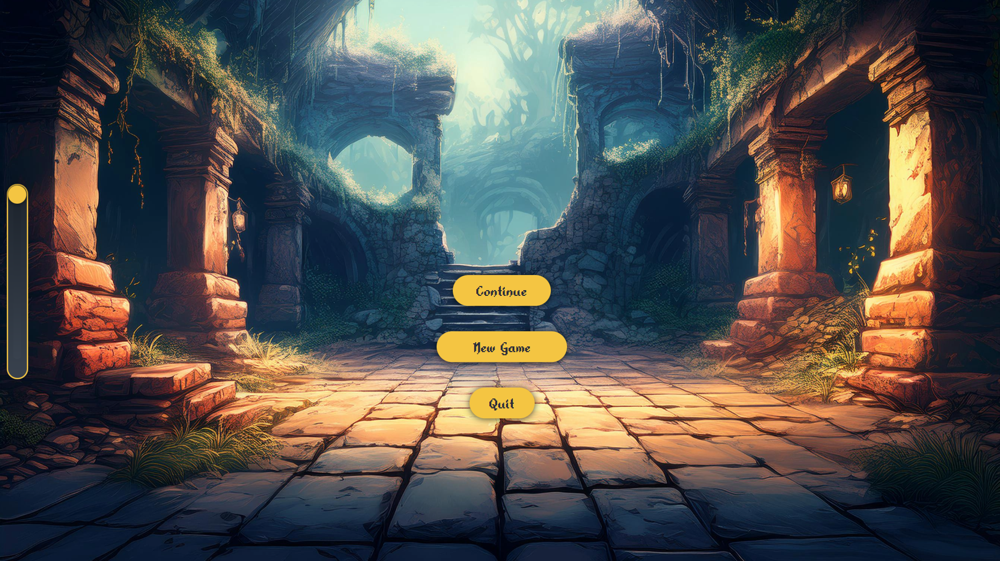
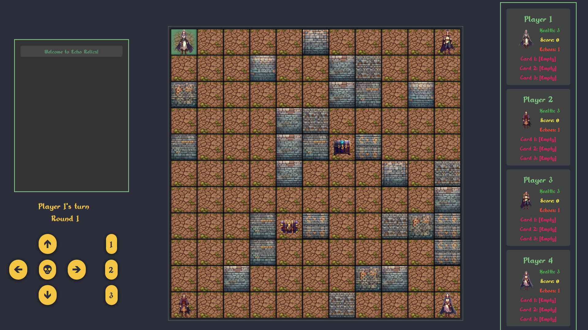

# Echo Relics: A Puzzle-Adventure Game

## Overview

Echo Relics is a turn-based, grid-based puzzle-adventure game set in a mystical world filled with ancient ruins. Players explore a dynamic grid, avoid traps, and collect powerful relics while dealing with echoes of their past moves. Success requires strategic planning, clever use of relics, and adaptability to challenges.

---


### **Tutorial**

1. **Movement Basics**:
   - Use the arrow keys or equivalent commands to navigate through the grid.
   - Plan your moves strategically to avoid traps and maximize your score.

2. **Echo Mechanic**:
   - After every move, an echo (a ghost version of the player) appears on the grid and moves randomly.
   - Echoes can interact with the grid and potentially trigger traps, adding an unpredictable element to gameplay.

3. **Relic Usage**:
   - Relics are scattered across the grid and grant special abilities when collected.
   - Some relics reveal traps, while others can influence the movement of echoes or provide bonus points.

4. **Scoring and Victory Conditions**:
   - Earn points by collecting relics and navigating the grid successfully.
   - The game ends when you reach 1000 points or are the last player standing.

5. **Grid Interaction**:
   - The grid dynamically changes as you progress, revealing new challenges and opportunities.
   - Larger grids (up to 15x15) introduce more complexity and require careful planning.

---

## Installation Instructions

### Prerequisites

- **Scala**: Ensure Scala is installed. [Install Scala](https://www.scala-lang.org/download/)
- **SBT**: Install the Scala Build Tool (SBT). [Install SBT](https://www.scala-sbt.org/)
- **Docker**: (Optional) Use Docker to containerize and run the game.

### Steps

1. Clone this repository:
   ```bash
   git clone https://github.com/your_username/echo-relics.git
   cd echo-relics
   ```

2. Build and run the game using SBT:
   ```bash
   sbt run
   ```

3. Alternatively, build and run the Docker container:
   ```bash
   docker build -t echo-relics .
   docker run -it --rm -e DISPLAY=host.docker.internal:0 echo-relics
   ```

---

## Preview




---

## License

This project is licensed under the MIT [LICENSE](LICENSE).

## Acknowledgments

This game was developed as part of a school project at HTWG Konstanz to demonstrate concepts of software engineering and game design.
